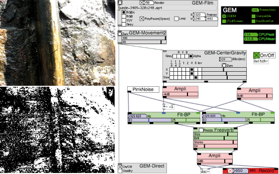

# ARGOPd
A collection of patches for Pure Data

ARGOPd is made of real-time sound and visual synthesis modules (MM) and patches (ExMM).

It runs on Pd Vanilla 0.47 or later.  
http://puredata.info/downloads/pure-data 

It needs libraries, all available on Deken:  
[ARGOPd-libraries.txt](ARGOPd-libraries.txt)

Most patches also work under Pd-0.43.4-extended  
[http://puredata.info/downloads/pd-extended](http://puredata.info/downloads/pd-extended/releases/0.43.4/)

For MacOSX, Linux, Windows.

A Module (or MiniModule MM) is a "subpatch" (not an "abstraction") with the property "graph on parent". 

ARGOPd is for users who have never programmed with Pure Data.

Under GPL-3.0 License  

The documentation [ARGOPdManuv051.pdf](ARGOPdManuv051.pdf) must be updated:  
replace: Pd-0.41.4-extended by: Pd-0.43.4-extended or Pd-0.50 + libraries, but remains valid.

http://gerard.paresys.free.fr/ARGOPd/  
or  
https://paresys.pagesperso-orange.fr/ARGOPd/

[ARGOPd FAQ](http://gerard.paresys.free.fr/ARGOPd/ARGOPdFAQ.html)  

email: gerard.paresys@free.fr

__________________________________________________________________
Based on the works of:  
- Algorithmic Composer: Markov chains  
   http://www.algorithmiccomposer.com/
- Ben Bogart: chaos library: lorenz  
   http://puredata.info/downloads/chaos/
- William Brent: streamStretch~, spectrogram, dryUp~, pitchHeight, martha~, convolve~, timbreID...  
   http://williambrent.conflations.com/pages/research.html  
   https://github.com/wbrent
- Martin Brinkmann: vowelfilter...  
   http://www.martin-brinkmann.de/pd-patches.html
- Ivica Ico Bukvic, Albert Graef, Jonathan Wilkes: disis_munger~  
   https://github.com/jonwwilkes/purr-data
- Nicolas d’Alessandro: mbrola~...  
   http://www.nicolasdalessandro.net/mbrolaobject
- Yves de Goyon: Grid, Pidip, probalizer...  
   http://ydegoyon.free.fr/software.html
- R. Luke DuBois & Dan Trueman: Percolate, munger...  
   https://github.com/Cycling74/percolate
- Tom Erbe: +pitchdelay~, +bubbler~, +compand~, +decimate, +delay...  
   https://www.soundhack.com/freeware/
- Andy Farnell (Obiwannabe): liquid, formant...  
   http://aspress.co.uk/sd/index.html
- Roman Haefeli: clap808...  
   https://github.com/reduzent
- Tobias Hartmann: one_sample_osc  
  https://github.com/tob-har/one_sample_osc
- Xavier Hautbois  
   https://xhautbois.pagesperso-orange.fr/index.html
- Cyrille Henry: pmpd...  
   http://drpichon.free.fr/pmpd/
- Derek Holzer: Particlechamber...  
   http://macumbista.net/?page_id=514
- Bryan Jurish (moocow): ssflite  
   http://kaskade.dwds.de/~moocow/mirror/projects/pd/
- Johannes Kreidler: Filter colors...  
   http://www.pd-tutorial.com/
- Gordan Krekovic: gendyn~.pd...  
   https://github.com/gkrekovic
- Matthias Kronlachner: pix_freenect, pix_depth2rgba, gendy~_osx_build  
   https://github.com/kronihias/pd-kinect-examples
- Labomedia (Olivier Baudu, Benjamin Cadon...)  
   https://ressources.labomedia.org
- Olaf Matthes: gauss, cauchy, freeverb~ ...  
   https://puredata.info/author/olafmatt 
- Chris McCormick: -obiwansd~...  
   https://github.com/chr15m/s-abstractions
- Thomas Ouellet Fredericks - Alexandre Quessy - Patrick Sebastien Coulombe - JKP  
   https://github.com/patricksebastien/mtl
- Leonard J. Paul: Surround Granulation  
   http://www.videogameaudio.com/
- Serge Poltavski: soundtouch~, fluid~, speech.flite...  
   https://github.com/uliss 
- Ville Pulkki: vbap  
   http://legacy.spa.aalto.fi/research/cat/vbap/
- Berenger Recoules  
   http://code.google.com/p/pdlive/  
   https://github.com/b2renger
- Christof Ressi: vstplugin~  
   https://github.com/Spacechild1/vstplugin  
- Spencer Russell: gendy~, sfr-granulator...  
   http://ssfrr.com/  
   https://github.com/ssfrr
- Ben Saylor: partconv~, zhzxh~, pvoc~...  
   http://puredata.info/downloads/bsaylor
- Hans-Christoph Steiner: filterview...  
   http://puredata.info/downloads/filterview/
- Tim Vets: Karplus-Strong, PDelayLama  
   http://www.timvets.net
- Katja Vetter: octave-harmonizer, soundtouch~...   
   http://www.katjaas.nl
- ... Thomas Musil ... IOhannes M Zmölnig ... Miller Puckette...  
   https://puredata.info/author/musil  
   https://git.iem.at/zmoelnig  
   https://github.com/millerpuckette
__________________________________________________________________
